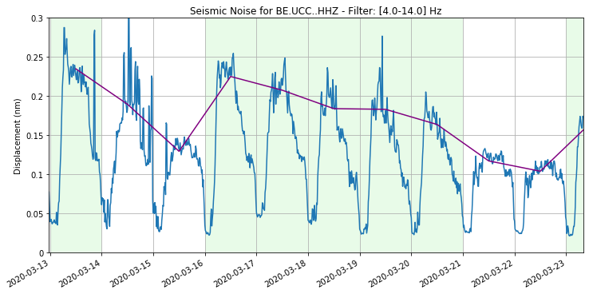
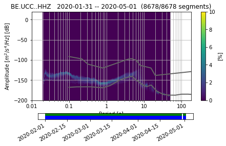
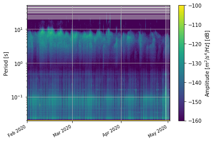
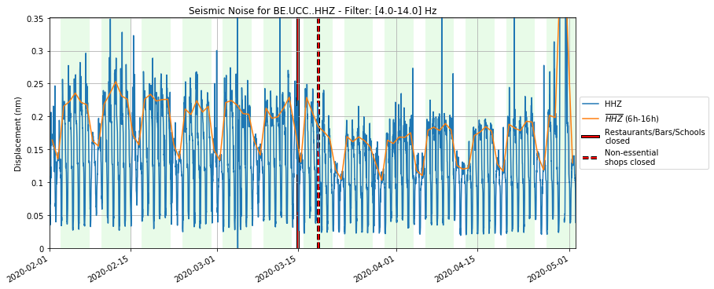
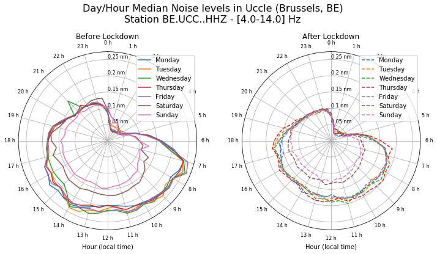
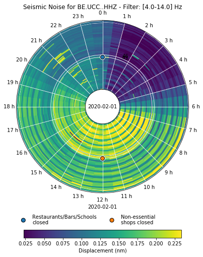
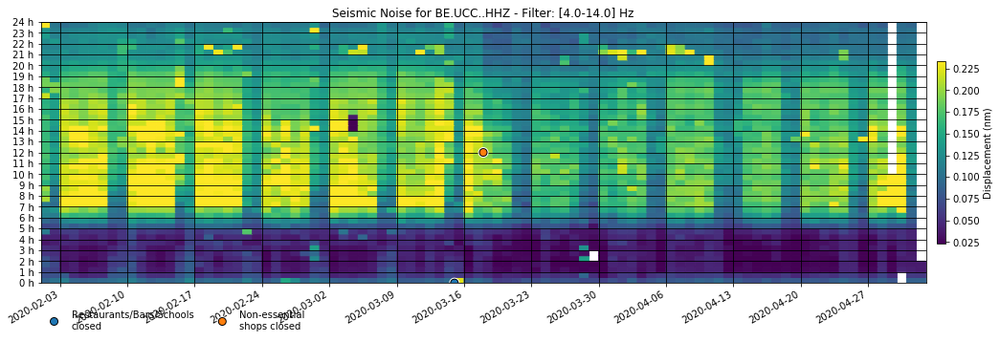

# Ground Motion Displacement RMS vs Time

*an example simple tutorial for getting seismic data, computing the power spectral densities, extracting the RMS and plotting*

Required:

- python
- obspy (and its dependencies)
- pandas
- jupyter
- notebook
- tqdm

this should be easy to set up in a conda env: ``conda create -c conda-forge -n covid python=3.7 obspy pandas jupyter notebook tqdm``

Author: Thomas Lecocq @seismotom, Fred Massin @fmassin

Run it interactively on [mybinder.org](https://mybinder.org/v2/gh/ThomasLecocq/SeismoRMS/master)

## Original Example:
This was the output of the original code shared on Twitter end of March 2020.
The following data shows the effect of the Social Distancing measures from the
Belgian Government (2020-03-16 at midnight, and 2020-03-18 at midday):

## Current Example:
The code has evolved and includes several new useful plots for interpreting the
time series.

### Standard ObsPy PPSD plots:

### New plots:

RMS time series:

Changes per day of week & time of day, before and after lockdown:

Changes per day of week & time of day, before and after lockdown, visualized as
a 24-hour clock:

Colormapped clock plot, each record of the disc is 1 day:

Colormapped grid plot, each column of the grid is 1 day:

